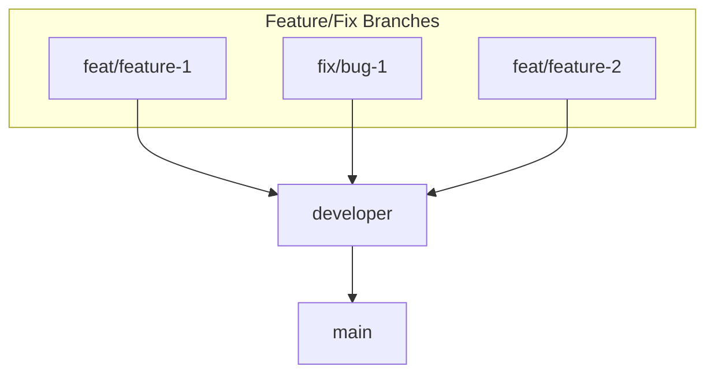

# PREPARATION-SE-FE

Welcome to **preparation-se-fe**, the frontend repository for study, preparation, and software engineering interview readiness.

## Branch Workflow

This repository uses a multi-branch workflow to organize development:

- **main**: Production-ready code. All releases are made from this branch.
- **developer**: Integration branch for features and fixes before merging into main.
- **features/fixes branch**: Feature development or bug fixes start here, merged into `developer` when ready.

### Typical Workflow

1. Create a new branch from `developer` for your feature or fix (e.g., `features/your-feature-name`).
2. Work on your changes, commit, and push the branch.
3. Open a pull request targeting `developer`.
4. **All pull requests must be reviewed and approved before merging into `developer` or `main`.**
5. After review, changes are merged into `developer`.
6. Periodically, `developer` is merged into `main` for releases.

### Workflow Diagram

> **Note:**  
> All pull requests **must be reviewed and approved** before they can be merged into the `developer` or `main` branches.
> Recommend: After merging, please delete your branch!!!
